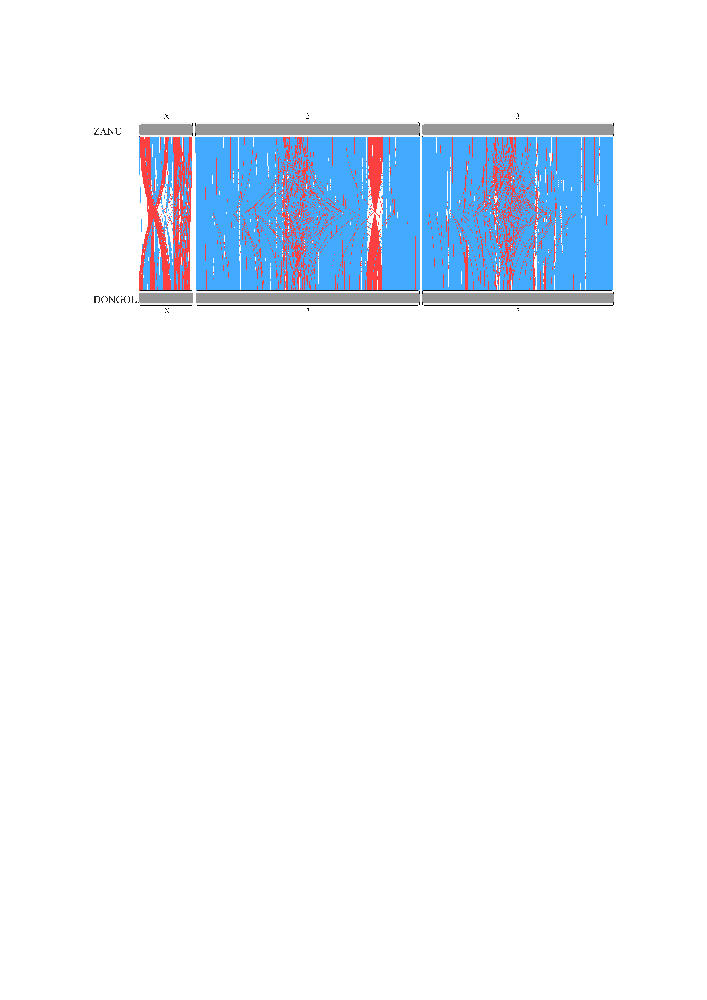

## Task


Create png file with synteny between ZANU and DONGOLA X, 2, and 3 chromosomes using the RIdeogram package.

## Solution

### Data import

First of all, let's import the dataset for both species and mapping info.

```{r warning=FALSE, include=FALSE}
# importing packages, which would be useful in the future
library("data.table")
library("dplyr")
library("tidyr")
```
```{r}
# dongola data
dongola <- read.table(file = '~/Университет ИТМО/Учёба/Магистратура/Statistics 2/GitHub_Homeworks/Homeworks/Homeworks_done/HW3_Raines/DONGOLA_genes.tsv', sep = '\t', header = TRUE)

# zanu data
zanu <- read.table(file = '~/Университет ИТМО/Учёба/Магистратура/Statistics 2/GitHub_Homeworks/Homeworks/Homeworks_done/HW3_Raines/ZANU_genes.tsv', sep = '\t', header = TRUE)

# data for results of gene mapping between two species
map <- read.table(file = '~/Университет ИТМО/Учёба/Магистратура/Statistics 2/GitHub_Homeworks/Homeworks/Homeworks_done/HW3_Raines/gene_mapping.tsv', sep = '\t', header = TRUE)
```


### Creating karyotype file for RIdeogram import

RIdeogram synteny plot requires 2 files: data about the sizes of chromosomes and synteny info. Let's start with the first one.

1. The length for the ZANU's chromosomes we know from the task file

X: 27238055
2: 114783175
3: 97973315

2. The length for the DONGOLA's chromosomes can be found in the [original publication](https://academic.oup.com/gigascience/article/10/3/giab017/6170950?login=true)

X: 26913133 
2: 111988354
3: 95710210

And know we can make the karyotype file.

```{r}
# create table for karyotype

karyotype_dual_comparison = data.table(
  Chr = c("X","2","3"),
  Start = 1,
  End = c(27238055, 114783175, 97973315, 26913133, 111988354, 95710210),
  fill = 969696,
  species = c("ZANU", "ZANU", "ZANU", "DONGOLA", "DONGOLA", "DONGOLA"),
  size = 12,
  color = 252525
)
```


```{r}
# the table

karyotype_dual_comparison
```


### Imported tables reshaping

So as to make the Synteny data appropriate to be imported to RIdeogram, several preparation steps should be done.

1. Change the "DONG" column so to separate the data


```{r}
# separate column

map <- map %>%
  separate(DONG, into = c("chr_dong", "middle_position_dong", "strand_dong", "length_gene", "name_dong"), sep = ",")

# fix DONG gene name

map$name_dong <- sub("^[^g]*", "", map$name_dong, ignore.case = F)
```

2. Filter ZANU chromosomes

```{r}
# only chromosomes 2, 3 and X left

map <- map %>%
  filter(contig == "2"|contig == "3"|contig == "X")

```

3. Convert DONG chromosomes and filter them

```{r}
# change names of chromosomes for map$chr_dong

old <- c("NC_053517.1", "NC_053518.1", "NC_053519.1")
new <- c("2", "3", "X")

for (i in 1:3){
  map$chr_dong[map$chr_dong == old[i]] <- new[i]
}

map <- map %>%
  filter(chr_dong == "2"|chr_dong == "3"|chr_dong == "X")
```

4. Rename columns

```{r}
# rename with dplyr

map <- rename(map, chr_zanu = contig, middle_position_zanu = middle.position, strand_zanu = strand, name_zanu = name)
```

5. Also it's worth to rename columns in ZANU and DONGOLA tables

```{r}
# as in previous chunk

zanu <- rename(zanu, name_zanu = ID, start_zanu = start, end_zanu = end, strand_zanu_add = strand)

dongola <- rename(dongola, name_dong = ID, start_dong = start, end_dong = end, strand_dong_add = strand)
```


6. And join all the tables

```{r}

map <- merge(map, zanu, all.x = TRUE)
map <- merge(map, dongola, all.x = TRUE)
```

7. According to the task, we should map only genes with synteny on similar chromosomes. So, let's filter the data by this option

```{r}
map <- map[(map$chr_zanu==map$chr_dong),]
```


8. As in the task, genes should be colored blue if they have the same direction and red if oposite. So, it's needed to make a color table.

```{r}
# find the necessary color with mutate function

map <- map %>% 
  mutate(fill = if_else(strand_zanu == strand_dong,"ff4040", "42aaff"))
```

9. Calculate the distances between middle positions to filter duplications.

```{r}
# fix middle_position_dong

map$middle_position_dong <- as.numeric(map$middle_position_dong)

# calculate distances

map$distance <- abs(map$middle_position_zanu - map$middle_position_dong)
map <- map[order(map$distance),]
map <- distinct(map, name_zanu, .keep_all = TRUE)
```

### Creating synteny table for RIdeogram

And then creating new table for synteny according to the information in **map** table.

```{r}
# creating synteny_dual_comparison table with select() function

synteny_dual_comparison <- select(map, c("chr_zanu", "start_zanu", "end_zanu", "chr_dong", "start_dong", "end_dong", "fill"))
```

And rename columns.

```{r}
synteny_dual_comparison <- rename(synteny_dual_comparison, Species_1 = chr_zanu, Start_1 = start_zanu, End_1 = end_zanu, Species_2 = chr_dong, Start_2 = start_dong, End_2 = end_dong)
```

Also, there is a problem that RIdeogram requires numerical names of chromosomes, so in synteny_dual_comparison **X** should be renames to **1**.

```{r}
# convert X chromosome to chr 1

synteny_dual_comparison$Species_1 <- gsub("X","1",as.character(synteny_dual_comparison$Species_1))
synteny_dual_comparison$Species_2 <- gsub("X","1",as.character(synteny_dual_comparison$Species_2))

# make values numeric

synteny_dual_comparison$Species_1 <- as.numeric(synteny_dual_comparison$Species_1)
synteny_dual_comparison$Species_2 <- as.numeric(synteny_dual_comparison$Species_2)
```


If we look at the plot (just suppose), we will we, that the 2nd and 3rd chromosomes are flipped in different directions. Let's fix it
```{r}
# fix the coordinates

synteny_dual_comparison <- synteny_dual_comparison %>%
  mutate(End_2 = if_else(Species_1 == 2, 111988354 - End_2, ifelse(Species_1 == 3, 95710210 - End_2, End_2)))

synteny_dual_comparison <- synteny_dual_comparison %>%
  mutate(Start_2 = if_else(Species_1 == 2, 111988354 - Start_2, ifelse(Species_1 == 3, 95710210 - Start_2, Start_2)))

```

### Plot construction

Finally, making the plot.

```{r}
# importing RIdeogram and creation plot

library("RIdeogram")

ideogram(karyotype = karyotype_dual_comparison, synteny = synteny_dual_comparison)
convertSVG("chromosome.svg", device = "png")
```


